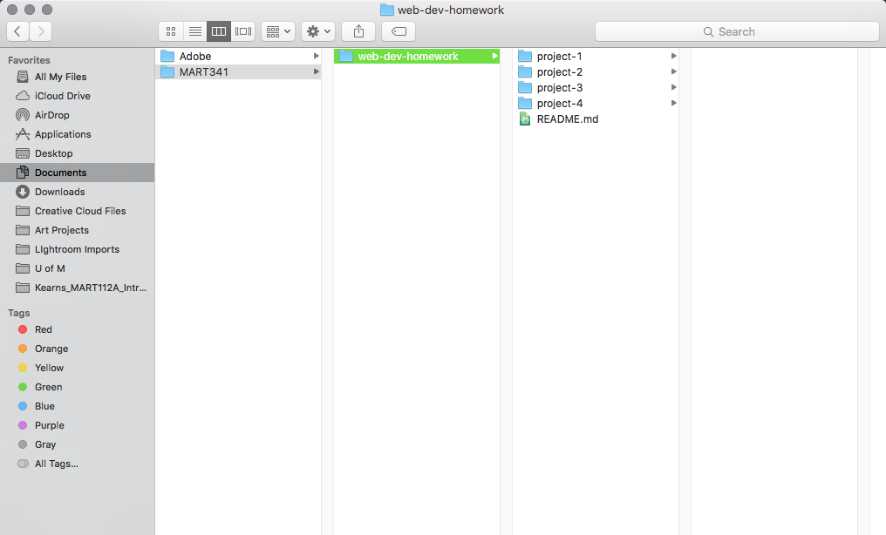

# My First README.md

## Ellen Morningstar (Previously Kearns, I know this is probably confusing)

**Headache** - how one feels after a long week of trying to figure out how to code.

*The Struggle* - I'd have to say the hardest part about this week constantly having to delete and start over because every time I would try to publish on github, nothing would show up. So I've finished and restarted this project at least 8 times.

1. I learned how to code
2. I also learned how not to code!

 - I also learned if you don't put a space before the dash, nothing happens!
 - Just in case anyone was wondering!

 ```

  This is a fancy code break
  Adding more information as I can't seem to get GitHub to work! 

 ```

 ---

 Figured I'd self promote since I have to have a link! [Ugly Horse Art](http://facebook.com/uglyhorseart)

---


