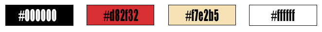
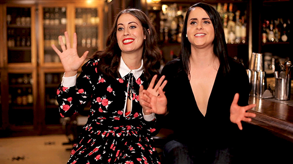
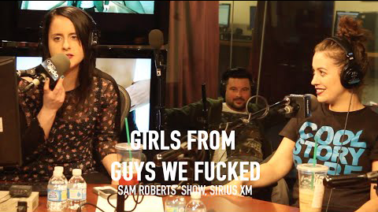

# Ellen Kearns
## Project 3 Readme

1. I will be pursuing a book showcase
2. I will do a site for the book "F*CKED: Being Sexually Explorative and Self-Confident in a World that's Screwed."
3. The ladies behind this masterpiece can be found here: [Guys We've F*cked](http://www.sorryaboutlastnightcomedy.com/guys-we-fucked/)
4. The color palette:

 
5. A quick visual of images:

 

6. Possible Fonts:

    [Oswald](https://fonts.google.com/specimen/Oswald) from Google Fonts
    [Open Sans Condensed](https://fonts.google.com/specimen/Open+Sans+Condensed) from google fonts.

7. Digression: This week has ultimately been a real challenge. Leading me to many emails with Justine as well as a solid slack session. However,
   my website is not complete. I have all of my details and all of my layout, but I've had serious issues with getting my actual pages to load my css code.
   I've had no issues applying stylings to my index, I just can't get css to work for my documents in the pages. At least I tried, quite hard actually! 
