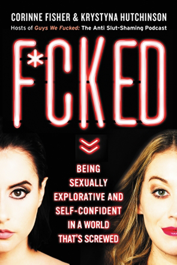

# Ellen Kearns
## Project 3 Readme

1. I will be pursuing a book showcase
2. I will do a site for the book "F*CKED: Being Sexually Explorative and Self-Confident in a World that's Screwed."
3. The ladies behind this masterpiece can be found here: [Guys We've F*cked](http://www.sorryaboutlastnightcomedy.com/guys-we-fucked/)
4. The color palette:

 
5. A quick visual of images:

 

6. Possible Fonts:

    [Oswald](https://fonts.google.com/specimen/Oswald) from Google Fonts
    [Open Sans Condensed](https://fonts.google.com/specimen/Open+Sans+Condensed) from google fonts.

Ending Project 3
The last few weeks have led my on a path of red wine and few face palms. Overall I tried my best; coding is not something I'm getting
the hang of and I'm okay with it. I don't plan on pursuing a career in coding or web design so I'm feeling pretty confident in what
I have learned and what I will forget by the time next semester rolls around. Not trying to be negative, just being incredibly honest.
I couldn't figure quite a bit out this week, like how to get more than one style sheet on an html page etc etc. Thankfully, Justine
was able to help me out so I could get the hang of it. 52 hours later I have a very unappealing website! 
